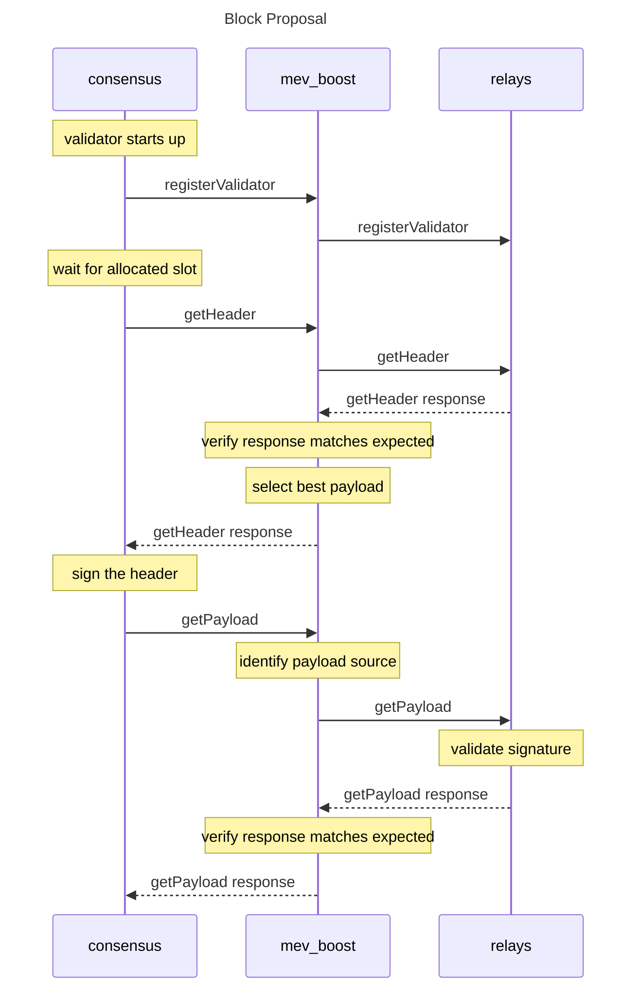

# mev-boost

[](https://goreportcard.com/report/github.com/flashbots/mev-boost)
[](https://github.com/flashbots/mev-boost/actions?query=workflow%3A%22Go%22)
[](https://discord.gg/7hvTycdNcK)
[](CODE_OF_CONDUCT.md)
[](https://github.com/RichardLitt/standard-readme)

`mev-boost` allows validators in Ethereum proof-of-stake to request blocks from a network of builders.

This project is part of the Flashbots research towards proposer/builder separation for Maximal Extractable Value (MEV) mitigation. `mev-boost` is connected to a relay that aggregates multiple builders. The builders prepare full blocks, optimizing for MEV extraction and fair distribution of the rewards. The Consensus Layer client of the validator proposes the most profitable block received from `mev-boost`.

[](https://excalidraw.com/#json=VHl16agggXE1wIcnRD2RP,1irpGwhVpEgt6k05u-MbaQ)

## Table of Contents

- [Background](#background)
- [Install](#install)
- [Usage](#usage)
- [The Plan](#the-plan)
- [Consensus Clients Implementation Status](#consensus-clients-implementation-status)
- [API](#api)
- [Maintainers](#maintainers)
- [Contributing](#contributing)
- [Security](#security)

## Background

MEV is a centralizing force on Ethereum. Unattended, the competition for MEV opportunities leads to consensus security instability and permissioned communication infrastructure between traders and block producers. This erodes neutrality, transparency, decentralization, and permissionlessness.

Flashbots is a research and development organization working on mitigating the negative externalities of MEV. Flashbots started as a builder specializing in MEV extraction in proof-of-work Ethereum to democratize access to MEV and make the most profitable blocks available to all miners. >90% of miners are outsourcing some of their block construction to Flashbots today.

`mev-boost` is a new middleware in which validators can sell their blockspace to not just Flashbots but other builders as well. This opens up the market to more builders and creates competition between them, leading to more revenue and choice for validators, and better censorship-resistance for Ethereum. From our [early explorations in Ethereum proof-of-stake](https://writings.flashbots.net/research/mev-eth2/) we found that “MEV can increase validator rewards by 75.3%, or give an APR of 12.86% rather than a non-MEV APR of 7.35% from staking eth.”

In the future, [proposer/builder separation](https://ethresear.ch/t/two-slot-proposer-builder-separation/10980) will be enshrined in the Ethereum protocol itself to further harden its trust model.

Read more in [Why run mev-boost?](https://writings.flashbots.net/writings/why-run-mevboost/) and in the [Frequently Asked Questions](https://github.com/flashbots/mev-boost/wiki/Frequently-Asked-Questions).

## Install

### From source

Install the dependencies:

- [Install go 1.18](https://go.dev/doc/install).
- Install required utilities:

```bash
go install github.com/ferranbt/fastssz/sszgen@latest
go install github.com/mgechev/revive@latest
go install honnef.co/go/tools/cmd/staticcheck@master
```

- Install build dependencies (in Ubuntu):

```bash
sudo apt install make gcc
```

Build:

```bash
make build
./mev-boost --help
```

### From Docker image

- [Install docker engine](https://docs.docker.com/engine/install/).
- Pull the latest image:

```bash
docker pull flashbots/mev-boost:latest
docker run flashbots/mev-boost --help
```

## Usage

First, install and run one of the [supported consensus clients](#consensus-clients-implementation-status). Here are the instructions to run a node in Kiln: https://notes.ethereum.org/@launchpad/kiln

Then, run mev-boost pointed at our Kiln builder+relay:

```bash
./mev-boost -kiln -relays https://0xb5246e299aeb782fbc7c91b41b3284245b1ed5206134b0028b81dfb974e5900616c67847c2354479934fc4bb75519ee1@builder-relay-kiln.flashbots.net
```

## The Plan

`mev-boost` is the next step on our exploration towards a trustless and decentralized MEV market. It is a service developed in collaboration with the Ethereum developers and researchers.

The roadmap, expected deliveries and estimated deadlines are described in [the plan](https://github.com/flashbots/mev-boost/wiki/The-Plan-(tm)). Join us in this repository while we explore the remaining [open research questions](https://github.com/flashbots/mev-boost/wiki/Research#open-questions) with all the relevant organizations in the ecosystem.

## Consensus Clients Implementation Status

| Project                                             | Status
| --------------------------------------------------- | ---------------------------------------------------------------------------------------- |
| [Teku](https://github.com/ConsenSys/teku)           | Completed, ready for testing ([#156](https://github.com/flashbots/mev-boost/issues/156)) |
| [Lighthouse](https://github.com/sigp/lighthouse)    | Advanced ([#160](https://github.com/flashbots/mev-boost/issues/160))                     |
| [Lodestar](https://github.com/ChainSafe/lodestar)   | Advanced ([#157](https://github.com/flashbots/mev-boost/issues/157))                     |
| [Nimbus](https://github.com/status-im/nimbus-eth2/) | In progress ([#159](https://github.com/flashbots/mev-boost/issues/159))                  |
| [Prysm](https://github.com/prysmaticlabs/prysm/)    | In progress ([#158](https://github.com/flashbots/mev-boost/issues/158))                  |

[Notes for implementers](https://github.com/flashbots/mev-boost/wiki#implementation-resources).

## API

`mev-boost` implements the [Builder API v0.1.0](https://github.com/ethereum/builder-specs/tree/v0.1.0).



## Maintainers

- [@metachris](https://github.com/metachris)
- [@Ruteri](https://github.com/Ruteri)
- [@elopio](https://github.com/elopio)

## Contributing

[Flashbots](https://flashbots.net) is a research and development collective working on mitigating the negative externalities of decentralized economies. We contribute with the larger free software community to illuminate the dark forest.

You are welcome here <3.

- If you want to join us, come and say hi in our [Discord chat](https://discord.com/invite/7hvTycdNcK).
- If you have a question, feedback or a bug report for this project, please [open a new Issue](https://github.com/flashbots/mev-boost/issues).
- If you would like to contribute with code, check the [CONTRIBUTING file](CONTRIBUTING.md).
- We just ask you to be nice. Read our [code of conduct](CODE_OF_CONDUCT.md).

## Security

If you find a security vulnerability on this project or any other initiative related to Flashbots, please let us know sending an email to security@flashbots.net.

## License

The code in this project is free software under the [MIT License](LICENSE).

---

Made with ☀️ by the ⚡🤖 collective.
