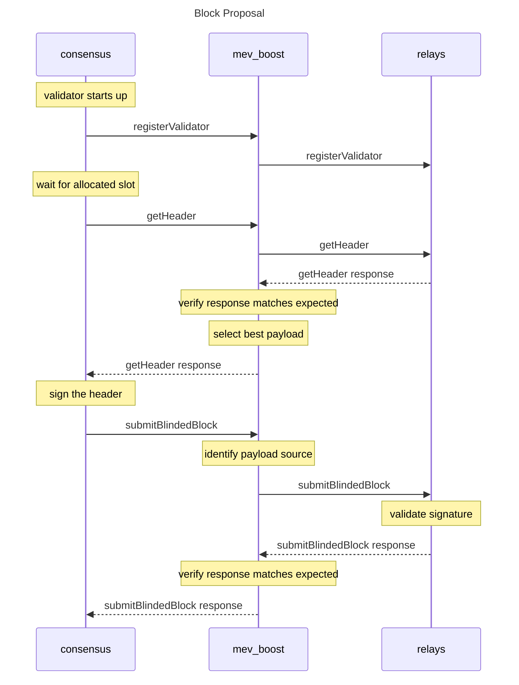

#

[](https://goreportcard.com/report/github.com/flashbots/mev-boost)
[](https://github.com/flashbots/mev-boost/actions?query=workflow%3A%22Tests%22)
[](https://hub.docker.com/r/flashbots/mev-boost/tags)

## What is MEV-Boost?

`mev-boost` is open source middleware run by validators to access a competitive block-building market. MEV-Boost is an initial implementation of [proposer-builder separation (PBS)](https://ethresear.ch/t/proposer-block-builder-separation-friendly-fee-market-designs/9725) for proof-of-stake (PoS) Ethereum.

With MEV-Boost, validators can access blocks from a marketplace of builders. Builders produce blocks containing transaction orderflow and a fee for the block proposing validator. Separating the role of proposers from block builders promotes greater competition, decentralization, and censorship-resistance for Ethereum.

## How does MEV-Boost work?

PoS node operators must run three pieces of software: a validator client, a consensus client, and an execution client. MEV-boost is a sidecar for the beacon node - a separate piece of open source software, which queries and outsources block-building to a network of builders. Block builders prepare full blocks, optimizing for MEV extraction and fair distribution of rewards. They then submit their blocks to relays.

Relays aggregate blocks from **multiple** builders in order to select the block with the highest fees. One instance of MEV-boost can be configured by a validator to connect to **multiple** relays. The consensus layer client of a validator proposes the most profitable block received from MEV-boost to the Ethereum network for attestation and block inclusion.

A MEV-Boost security assessment was conducted on 2022-06-20 by [lotusbumi](https://github.com/lotusbumi). Additional information can be found in the [Security](#security) section of this repository.


## Who can run MEV-Boost?

MEV-Boost is a piece of software that any PoS Ethereum node operator (including solo validators) can run as part of their Beacon Client software. It is compatible with any Ethereum consensus client. Support and installation instructions for each client can be found [here](#installing).

---

See also:

* [MEV-Boost Docker images](https://hub.docker.com/r/flashbots/mev-boost)
* [Wiki](https://github.com/flashbots/mev-boost/wiki)
* Specs:
  * [Builder API](https://ethereum.github.io/builder-specs)

---

# Table of Contents

- [Background](#background)
- [Installing](#installing)
  - [Binaries](#binaries)
  - [From source](#from-source)
  - [From Docker image](#from-docker-image)
  - [Systemd configuration](#systemd-configuration)
- [Usage](#usage)
  - [Mainnet](#mainnet)
  - [Goerli testnet](#goerli-testnet)
  - [Sepolia testnet](#sepolia-testnet)
  - [`test-cli`](#test-cli)
  - [mev-boost cli arguments](#mev-boost-cli-arguments)
- [API](#api)
- [Maintainers](#maintainers)
- [Contributing](#contributing)
- [Security](#security)
  - [Bug Bounty](#bug-bounty)
  - [Audits](#audits)
- [License](#license)

---

# Background

MEV is a centralizing force on Ethereum. Unattended, the competition for MEV opportunities leads to consensus security instability and permissioned communication infrastructure between traders and block producers. This erodes neutrality, transparency, decentralization, and permissionlessness.

Proposer/block-builder separation (PBS) was initially proposed by Ethereum researchers as a response to the risk that MEV poses to decentralization of consensus networks. They have suggested that uncontrolled MEV extraction promotes economies of scale which are centralizing in nature, and complicate decentralized pooling.


In the future, [proposer/builder separation](https://ethresear.ch/t/two-slot-proposer-builder-separation/10980) will be enshrined in the Ethereum protocol itself to further harden its trust model.

Read more in [Why run MEV-Boost?](https://writings.flashbots.net/why-run-mevboost/) and in the [Frequently Asked Questions](https://github.com/flashbots/mev-boost/wiki/Frequently-Asked-Questions).

# Installing

The most common setup is to install MEV-Boost on the same machine as the beacon client. Multiple beacon-clients can use a single MEV-Boost instance. The default port is 18550.

See also [Rémy Roy's guide](https://github.com/remyroy/ethstaker/blob/main/prepare-for-the-merge.md#installing-mev-boost) for comprehensive instructions on installing, configuring and running MEV-Boost.

## Binaries

Each release includes binaries from Linux, Windows and macOS. You can find the latest release at
https://github.com/flashbots/mev-boost/releases


## From source

Requires [Go 1.18+](https://go.dev/doc/install).

### `go install`

Install the latest MEV-Boost release with `go install`:

```bash
go install github.com/flashbots/mev-boost@latest
mev-boost -help
```

### Clone and Build

Ensure you are downloading the most updated MEV-Boost release. Releases are available at https://github.com/flashbots/mev-boost/releases

clone the repository and build it:

```bash
# By default, the develop branch includes ongoing merged PRs a future release.
git clone https://github.com/flashbots/mev-boost.git
cd mev-boost

# You can use the stable branch, which is always updated with the latest released version
git checkout stable

# If you want to build a specific release, check out the tag. See also https://github.com/flashbots/mev-boost/releases
git checkout tags/YOUR_VERSION

# Build most recent version of MEV-Boost
make build

# Show help. This confirms MEV-Boost is able to start
./mev-boost -help
```

## From Docker image

We maintain a MEV-Boost Docker images at https://hub.docker.com/r/flashbots/mev-boost

- [Install Docker Engine](https://docs.docker.com/engine/install/)
- Pull & run the latest image:

```bash
# Get the MEV-Boost image
docker pull flashbots/mev-boost:latest

# Run it
docker run flashbots/mev-boost -help
```

## Systemd configuration

You can run MEV-Boost with a systemd config like this:

<details>
<summary><code>/etc/systemd/system/mev-boost.service</code></summary>

```ini
[Unit]
Description=mev-boost
Wants=network-online.target
After=network-online.target

[Service]
User=mev-boost
Group=mev-boost
WorkingDirectory=/home/mev-boost
Type=simple
Restart=always
RestartSec=5
ExecStart=/home/mev-boost/bin/mev-boost \
        -relay-check \
        -relay YOUR_RELAY_CHOICE_A \
        -relay YOUR_RELAY_CHOICE_B \
        -relay YOUR_RELAY_CHOICE_C

[Install]
WantedBy=multi-user.target
```
</details>


# Usage

A single MEV-Boost instance can be used by multiple beacon nodes and validators.

Aside from running MEV-Boost on your local network, you must configure:
* individual **beacon nodes** to connect to MEV-Boost. Beacon Node configuration varies by Consensus client. Guides for each client can be found on the [MEV-boost website](https://boost.flashbots.net/#block-356364ebd7cc424fb524428ed0134b21).
* individual **validators** to configure a preferred relay selection. Note: validators should take precautions to only connect to trusted relays. Read more about [the role of relays here](https://docs.flashbots.net/flashbots-mev-boost/relay).

Lists of available relays are maintained by
* [Ethstaker](https://github.com/remyroy/ethstaker/blob/main/MEV-relay-list.md) [[2]](https://ethstaker.cc/mev-relay-list/)
* [Lido](https://research.lido.fi/t/lido-on-ethereum-call-for-relay-providers/2844)

## Note on usage documentation

The documentation in this README reflects the latest state of the `main` branch, which may have cli flags or functionality not present in the latest release.

Please take a look at the specific release documentation about the available command line flags: https://github.com/flashbots/mev-boost/releases

## Mainnet

Run MEV-Boost pointed at a mainnet relay:

```
./mev-boost -relay-check -relay URL-OF-TRUSTED-RELAY
```

## Goerli testnet

Run MEV-Boost pointed at a Goerli relay:

```
./mev-boost -goerli -relay-check -relay URL-OF-TRUSTED-RELAY
```

## Sepolia testnet

Run MEV-Boost pointed at a Sepolia relay:

```
./mev-boost -sepolia -relay-check -relay URL-OF-TRUSTED-RELAY
```

## Zhejiang testnet

Run MEV-Boost pointed at a Zhejiang relay:

```
./mev-boost -zhejiang -relay-check -relay URL-OF-TRUSTED-RELAY
```

## `test-cli`

`test-cli` is a utility to execute all proposer requests against MEV-Boost + relay. See also the [test-cli readme](cmd/test-cli/README.md).


## mev-boost cli arguments

These are the CLI arguments for the develop branch. For arguments available in a specific release, check the [release page](https://github.com/flashbots/mev-boost/releases).

```
$ ./mev-boost -help
Usage of mev-boost:
  -addr string
        listen-address for mev-boost server (default "localhost:18550")
  -debug
        shorthand for '-loglevel debug'
  -genesis-fork-version string
        use a custom genesis fork version
  -goerli
        use Goerli
  -json
        log in JSON format instead of text
  -log-no-version
        disables adding the version to every log entry
  -log-service string
        add a 'service=...' tag to all log messages
  -loglevel string
        minimum loglevel: trace, debug, info, warn/warning, error, fatal, panic (default "info")
  -mainnet
        use Mainnet (default true)
  -min-bid float
        minimum bid to accept from a relay [eth]
  -relay value
        a single relay, can be specified multiple times
  -relay-check
        check relay status on startup and on the status API call
  -relay-monitor value
        a single relay monitor, can be specified multiple times
  -relay-monitors string
        relay monitor urls - single entry or comma-separated list (scheme://host)
  -relays string
        relay urls - single entry or comma-separated list (scheme://pubkey@host)
  -request-timeout-getheader int
        timeout for getHeader requests to the relay [ms] (default 950)
  -request-timeout-getpayload int
        timeout for getPayload requests to the relay [ms] (default 4000)
  -request-timeout-regval int
        timeout for registerValidator requests [ms] (default 3000)
  -sepolia
        use Sepolia
  -version
        only print version
```

### `-relays` vs `-relay`

There are two different flags for specifying relays: `-relays` and `-relay`.
The `-relays` flag is a comma separated string of relays. On the other hand,
the `-relay` flag is used to specify a single relay, but can be used multiple
times for multiple relays. Use whichever method suits your preferences.

These two MEV-Boost commands are equivalent:

```
./mev-boost -relay-check \
    -relays $YOUR_RELAY_CHOICE_A,$YOUR_RELAY_CHOICE_B,$YOUR_RELAY_CHOICE_C
```

```
./mev-boost -relay-check \
    -relay $YOUR_RELAY_CHOICE_A \
    -relay $YOUR_RELAY_CHOICE_B \
    -relay $YOUR_RELAY_CHOICE_C
```


### Setting a minimum bid value with `-min-bid`

The `-min-bid` flag allows setting a minimum bid value. If no bid from the builder network delivers at least this value, MEV-Boost will not return a bid
to the beacon node, making it fall back to local block production.

Example for setting a minimum bid value of 0.06 ETH:

```
./mev-boost \
    -min-bid 0.06 \
    -relay $YOUR_RELAY_CHOICE_A \
    -relay $YOUR_RELAY_CHOICE_B \
    -relay $YOUR_RELAY_CHOICE_C
```


---

# API

`mev-boost` implements the latest [Builder Specification](https://github.com/ethereum/builder-specs).



# Maintainers

- [@metachris](https://github.com/metachris)
- [@jtraglia](https://github.com/jtraglia)
- [@ralexstokes](https://github.com/ralexstokes)
- [@terencechain](https://github.com/terencechain)
- [@lightclient](https://github.com/lightclient)
- [@avalonche](https://github.com/avalonche)
- [@Ruteri](https://github.com/Ruteri)

# Contributing

You are welcome here <3.

- If you have a question, feedback or a bug report for this project, please [open a new Issue](https://github.com/flashbots/mev-boost/issues).
- If you would like to contribute with code, check the [CONTRIBUTING file](CONTRIBUTING.md) for further info about the development environment.
- We just ask you to be nice. Read our [code of conduct](CODE_OF_CONDUCT.md).

# Security

If you find a security vulnerability in this project or any other initiative
related to proposer/builder separation in ethereum, please let us know sending
an email to security@flashbots.net. Refer to the [SECURITY file](SECURITY.md)
for details.

## Bug Bounty

We have a bug bounty program! Get up to $25k USD for a critical vulnerability.

We would like to welcome node operators, builders, searchers, and other
participants in the ecosystem to contribute to this bounty pool to help make the
ecosystem more secure.

## Audits

- [20220620](docs/audit-20220620.md), by [lotusbumi](https://github.com/lotusbumi).

# License

The code in this project is free software under the [MIT License](LICENSE).

Logo by [@lekevicius](https://twitter.com/lekevicius) on CC0 license.
