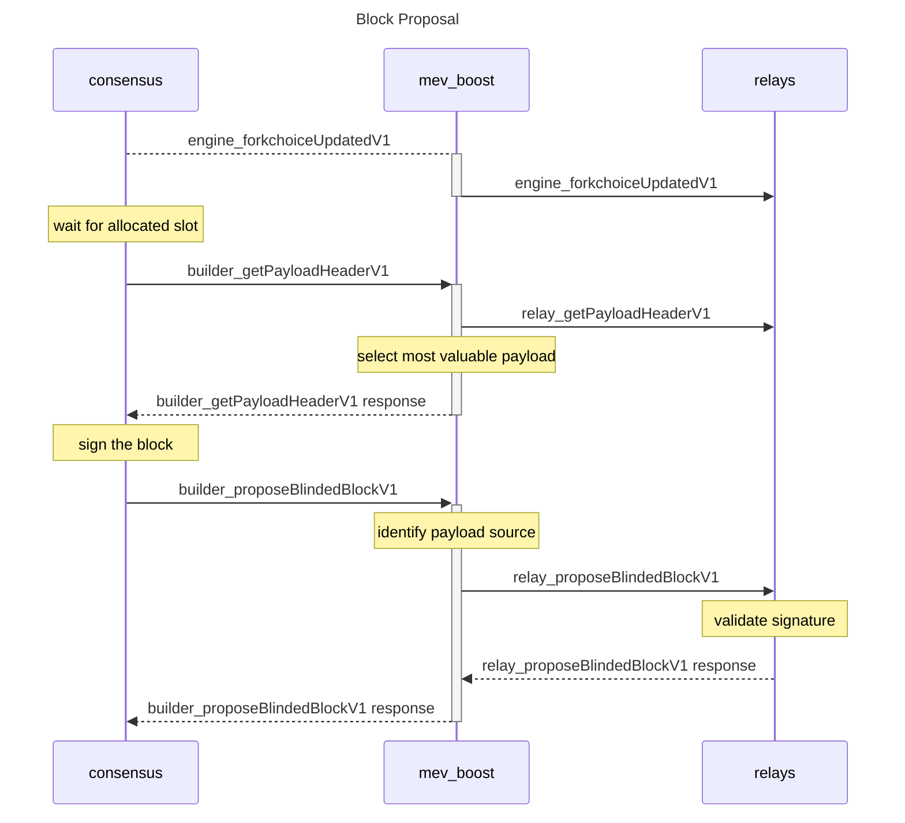

# mev-boost

[](https://github.com/flashbots/mev-boost/actions?query=workflow%3A%22Go%22)
[](https://discord.gg/7hvTycdNcK)
[](CODE_OF_CONDUCT.md)

A middleware server written in Go, that sits between an ethereum PoS consensus client and an execution client. It allows consensus clients to outsource block construction to third party block builders as well as fallback to execution clients. See [ethresearch post](https://ethresear.ch/t/mev-boost-merge-ready-flashbots-architecture/11177/) for the high level architecture.



## Table of Contents
- [mev-boost](#mev-boost)
  - [Implementation Plan](#implementation-plan)
  - [Build](#build)
  - [Test](#test)
  - [Lint](#lint)
  - [Running with mergemock](#running-with-mergemock)

## Implementation Plan

A summary of consensus client changes can be found [here](https://hackmd.io/@paulhauner/H1XifIQ_t).

### Version 0.1 (current, milestone 1, running on Kiln testnet)

simple sidecar logic with minimal consensus client changes, simple networking, no authentication, and manual safety mechanism

- [x] _mev-boost_ sends `feeRecipient` to relay with direct `engine_forkchoiceUpdatedV1` request at beginning of block
- [x] _mev-boost_ fetches signed payloads from relay using unauthenticated `getPayloadHeader` request
- [x] _mev-boost_ selects best payload that matches expected `payloadId` and requests signature from consensus client, this requires passing header object to the consensus client and flagging that it should be returned to the middleware once signed
- [x] _mev-boost_ returns signed block + initial payload header to relay with direct request

Specification: https://github.com/flashbots/mev-boost/wiki/Specification

### Version 1.0 (next, milestone 2, the merge)

security, authentication & reputation

- [ ] _mev-boost_ requests authenticated `feeRecipient` message from consensus client and gossips over p2p at regular interval
- [ ] add module for verifying previous relay payload validity and accuracy with hard or statistical blacklist (may require modifications to execution client)
- [ ] add module for subscribing to 3rd party relay monitoring service

#### required client modifications

- in event of middleware crash, consensus client must be able to bypass the middleware to reach a local or remote execution client
- consensus client must implement [Proposal Promises](https://hackmd.io/@paulhauner/H1XifIQ_t#Change-2-Proposal-Promises)

### Version 2.0 - privacy (optional)

add p2p comms mechanisms to prevent validator deanonymization

- [ ] _mev-boost_ gossips signed block + initial payload header over p2p

#### required client modifications

- consensus client must implement [New Gossipsub Topics](https://hackmd.io/@paulhauner/H1XifIQ_t#Change-3-New-Gossipsub-Topics)

### Version 3.0 - configurations (optional)

add optional configurations to provide alternative guarantees

- [ ] consider adding direct `relay_forkchoiceUpdatedV1` call to relay for syncing state
- [ ] consider returning full payload directly to validator as optimization
- [ ] consider adding merkle proof of payment to shift verification requirements to the relay

## Build

```
make build
```

and then run it with:

```
./mev-boost
```

## Test

```
make test
```

## Lint

We use `revive` as a linter. You need to install it with `go install github.com/mgechev/revive@latest`

```
make lint
```

## Running with mergemock

We are currently testing using a forked version of mergemock, see https://github.com/flashbots/mergemock

Make sure you've setup and built mergemock first, refer to its [README](https://github.com/flashbots/mergemock#quick-start) but here's a quick setup guide:

```
git clone https://github.com/flashbots/mergemock.git
cd mergemock
go build . mergemock
wget https://gist.githubusercontent.com/lightclient/799c727e826483a2804fc5013d0d3e3d/raw/2e8824fa8d9d9b040f351b86b75c66868fb9b115/genesis.json
```

Then you can run an integration test with mergemock, spawning both a mergemock execution engine and a mergemock consensus client as well as mev-boost:

```
cd mev-boost
make run-mergemock-integration
```

The path to the mergemock repo is assumed to be `../mergemock`, you can override like so:

```
make MERGEMOCK_DIR=/PATH-TO-MERGEMOCK-REPO run-mergemock-integration
```

to run mergemock in dev mode:

```
make MERGEMOCK_BIN='go run .' run-mergemock-integration
```
