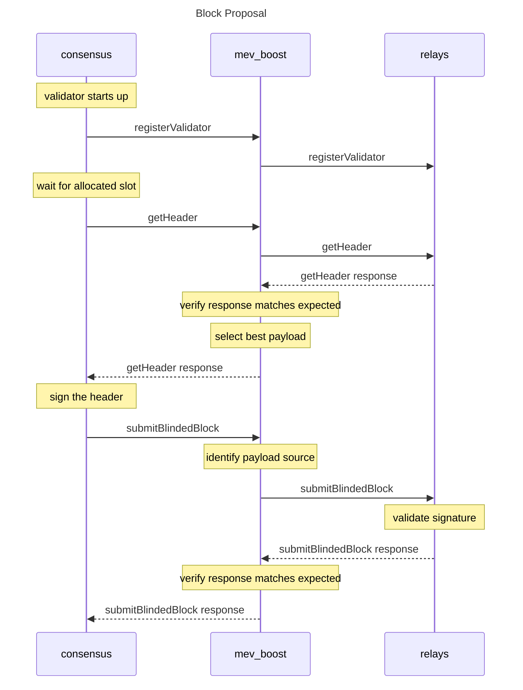

# mev-boost

[](https://goreportcard.com/report/github.com/flashbots/mev-boost)
[](https://github.com/flashbots/mev-boost/actions?query=workflow%3A%22Tests%22)
[](CODE_OF_CONDUCT.md)

`mev-boost` allows validators in Ethereum proof-of-stake to request blocks from a network of builders.

This project is part of the Flashbots research towards proposer/builder separation for Maximal Extractable Value (MEV) mitigation. `mev-boost` can connect to relays that aggregate multiple builders. The builders prepare full blocks, optimizing for MEV extraction and fair distribution of the rewards. The Consensus Layer client of the validator proposes the most profitable block received from `mev-boost`.

---


---

See also:

* [Builder API specification](https://ethereum.github.io/builder-specs)
* [mev-boost Docker image](https://hub.docker.com/r/flashbots/mev-boost)
* [Integration docs (mev-boost wiki)](https://github.com/flashbots/mev-boost/wiki)

---

# Table of Contents

- [Background](#background)
- [Installing](#installing)
- [Usage](#usage)
- [Consensus Clients Implementation Status](#consensus-clients-implementation-status)
- [The Plan](#the-plan)
- [API](#api)
- [Maintainers](#maintainers)
- [Contributing](#contributing)
- [Security](#security)

# Background

MEV is a centralizing force on Ethereum. Unattended, the competition for MEV opportunities leads to consensus security instability and permissioned communication infrastructure between traders and block producers. This erodes neutrality, transparency, decentralization, and permissionlessness.

Flashbots is a research and development organization working on mitigating the negative externalities of MEV. Flashbots started as a builder specializing in MEV extraction in proof-of-work Ethereum to democratize access to MEV and make the most profitable blocks available to all miners. >90% of miners are outsourcing some of their block construction to Flashbots today.

`mev-boost` is a new middleware in which validators can offer their blockspace to not just Flashbots but other builders as well. This opens up the market to more builders and creates competition between them, leading to more revenue and choice for validators, and better censorship-resistance for Ethereum. From our [early explorations in Ethereum proof-of-stake](https://writings.flashbots.net/research/mev-eth2/) we found that “MEV can increase validator rewards by 75.3%, or give an APR of 12.86% rather than a non-MEV APR of 7.35% from staking eth.”

In the future, [proposer/builder separation](https://ethresear.ch/t/two-slot-proposer-builder-separation/10980) will be enshrined in the Ethereum protocol itself to further harden its trust model.

Read more in [Why run mev-boost?](https://writings.flashbots.net/writings/why-run-mevboost/) and in the [Frequently Asked Questions](https://github.com/flashbots/mev-boost/wiki/Frequently-Asked-Questions).

# Installing

`mev-boost` can run in any machine, as long as it is reachable by the validator client. The default port is 18550. The most common setup is to install it in the same machine as the validator client.

## Dependencies

- [Go 1.18+](https://go.dev/doc/install)

## From source

Install mev-boost with `go install`:

```bash
go install github.com/flashbots/mev-boost@latest
mev-boost -help
```

Or clone the repository and build it:

```bash
git clone https://github.com/flashbots/mev-boost.git
cd mev-boost
make build

# Show the help
./mev-boost -help
```

## From Docker image

We maintain a mev-boost Docker image at https://hub.docker.com/r/flashbots/mev-boost

- [Install Docker Engine](https://docs.docker.com/engine/install/)
- Pull & run the latest image:

```bash
docker pull flashbots/mev-boost:latest
docker run flashbots/mev-boost -help
```

# Usage

First, install and run one of the [supported consensus clients](#consensus-clients-implementation-status).

### Goerli Shadow Fork 5

Run mev-boost pointed at our [Goerli Shadow Fork 5 Relay](https://builder-relay-goerli-sf5.flashbots.net):

```bash
./mev-boost -goerli-shadow-fork-5 -relays https://0xafa4c6985aa049fb79dd37010438cfebeb0f2bd42b115b89dd678dab0670c1de38da0c4e9138c9290a398ecd9a0b3110@builder-relay-goerli-sf5.flashbots.net
```

### Ropsten testnet

Run mev-boost pointed at our [Ropsten Relay](https://builder-relay-ropsten.flashbots.net/):

```
 ./mev-boost -ropsten -relays https://0xb124d80a00b80815397b4e7f1f05377ccc83aeeceb6be87963ba3649f1e6efa32ca870a88845917ec3f26a8e2aa25c77@builder-relay-ropsten.flashbots.net
```

### Kiln testnet

Run mev-boost pointed at our [Kiln Relay](https://builder-relay-kiln.flashbots.net):

```bash
./mev-boost -kiln -relays https://0xb5246e299aeb782fbc7c91b41b3284245b1ed5206134b0028b81dfb974e5900616c67847c2354479934fc4bb75519ee1@builder-relay-kiln.flashbots.net
```

### Sepolia testnet

Run mev-boost pointed at our [Sepolia Relay](https://builder-relay-sepolia.flashbots.net/):

```
 ./mev-boost -sepolia -relays https://0x845bd072b7cd566f02faeb0a4033ce9399e42839ced64e8b2adcfc859ed1e8e1a5a293336a49feac6d9a5edb779be53a@builder-relay-sepolia.flashbots.net
```

#### `test-cli`

`test-cli` is a utility to execute all proposer requests against mev-boost+relay. See also the [test-cli readme](cmd/test-cli/README.md).

# Consensus Clients Implementation Status

| Project                                             | Status                                                                                   |
|-----------------------------------------------------|------------------------------------------------------------------------------------------|
| [Teku](https://github.com/ConsenSys/teku)           | Completed, ready for testing ([#156](https://github.com/flashbots/mev-boost/issues/156)) |
| [Prysm](https://github.com/prysmaticlabs/prysm/)    | Completed, ready for testing ([#158](https://github.com/flashbots/mev-boost/issues/158)) |
| [Lighthouse](https://github.com/sigp/lighthouse)    | Advanced ([#160](https://github.com/flashbots/mev-boost/issues/160))                     |
| [Lodestar](https://github.com/ChainSafe/lodestar)   | Advanced ([#157](https://github.com/flashbots/mev-boost/issues/157))                     |
| [Nimbus](https://github.com/status-im/nimbus-eth2/) | In progress ([#159](https://github.com/flashbots/mev-boost/issues/159))                  |

[Notes for implementers](https://github.com/flashbots/mev-boost/wiki#implementation-resources).


# The Plan

`mev-boost` is the next step on our exploration towards a trustless and decentralized MEV market. It is a service developed in collaboration with the Ethereum developers and researchers.

The roadmap, expected deliveries and estimated deadlines are described in [the plan](https://github.com/flashbots/mev-boost/wiki/The-Plan-(tm)). Join us in this repository while we explore the remaining [open research questions](https://github.com/flashbots/mev-boost/wiki/Research#open-questions) with all the relevant organizations in the ecosystem.

# API

`mev-boost` implements the latest [Builder Specification](https://github.com/ethereum/builder-specs).



# Maintainers

- [@metachris](https://github.com/metachris)
- [@Ruteri](https://github.com/Ruteri)
- [@elopio](https://github.com/elopio)

# Contributing

[Flashbots](https://flashbots.net) is a research and development collective working on mitigating the negative externalities of decentralized economies. We contribute with the larger free software community to illuminate the dark forest.

You are welcome here <3.

- If you have a question, feedback or a bug report for this project, please [open a new Issue](https://github.com/flashbots/mev-boost/issues).
- If you would like to contribute with code, check the [CONTRIBUTING file](CONTRIBUTING.md) for further info about the development environment.
- We just ask you to be nice. Read our [code of conduct](CODE_OF_CONDUCT.md).

# Security

If you find a security vulnerability on this project or any other initiative related to Flashbots, please let us know sending an email to security@flashbots.net.

# License

The code in this project is free software under the [MIT License](LICENSE).

Logo by [@lekevicius](https://twitter.com/lekevicius) on CC0 license.

---

Made with ☀️ by the ⚡🤖 collective.
