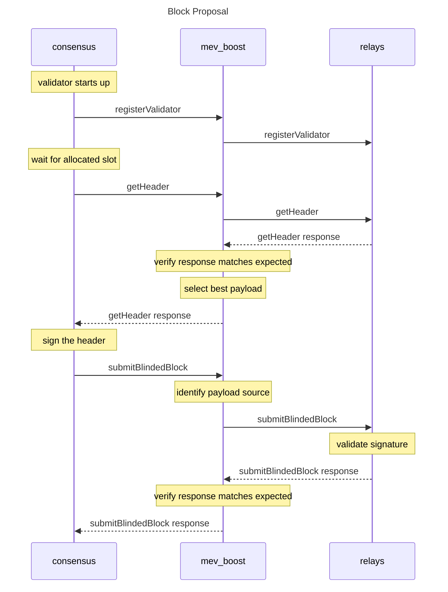

#

[](https://goreportcard.com/report/github.com/flashbots/mev-boost)
[](https://github.com/flashbots/mev-boost/actions?query=workflow%3A%22Tests%22)

## What is MEV-Boost?

`mev-boost` is open source middleware run by validators to access a competitive block-building market. MEV-Boost was built by Flashbots as an implementation of [proposer-builder separation (PBS)](https://ethresear.ch/t/proposer-block-builder-separation-friendly-fee-market-designs/9725) for proof-of-stake (PoS) Ethereum.

With MEV-Boost, validators can access blocks from a marketplace of builders. Builders produce blocks containing transaction orderflow and a fee for the block proposing validator. Separating the role of proposers from block builders promotes greater competition, decentralization, and censorship-resistance for Ethereum.

## How does MEV-Boost work?

PoS node operators must run three pieces of software: a validator client, a consensus client, and an execution client. MEV-boost is a sidecar for the Consensus client, a separate piece of open source software, which queries and outsources block-building to a network of builders. Block builders prepare full blocks, optimizing for MEV extraction and fair distribution of rewards. They then submit their blocks to relays.

Relays aggregate blocks from **multiple** builders in order to select the block with the highest fees. One instance of MEV-boost can be configured by a validator to connect to **multiple** relays. The Consensus Layer client of a validator proposes the most profitable block received from MEV-boost to the Ethereum network for attestation and block inclusion.

A MEV-Boost security assessment was conducted on 2022-06-20 by [lotusbumi](https://github.com/lotusbumi). Additional audits of surrounding infrastructure, such as the Flashbots Relay, are currently underway.


## Who can run MEV-Boost?

MEV-Boost is a piece of software that any PoS Ethereum node operator (including solo validators) can run as part of their Beacon Client software. It is compatible with any Ethereum consensus client. Support and installation instructions for each client can be found [here](#installing).

---

See also:

* [boost.flashbots.net](https://boost.flashbots.net)
* [MEV-Boost Docker images](https://hub.docker.com/r/flashbots/mev-boost)
* [wiki](https://github.com/flashbots/mev-boost/wiki) & [troubleshooting guide](https://github.com/flashbots/mev-boost/wiki/Troubleshooting)
* [MEV-Boost relay source code](https://github.com/flashbots/mev-boost-relay)
* Specs:
  * [Builder API](https://ethereum.github.io/builder-specs)
  * [Flashbots Relay API](https://flashbots.notion.site/Relay-API-Spec-5fb0819366954962bc02e81cb33840f5)


# Table of Contents

- [Table of Contents](#table-of-contents)
- [Background](#background)
- [Installing](#installing)
  - [Binaries](#binaries)
  - [From source](#from-source)
    - [`go install`](#go-install)
    - [Clone and Build](#clone-and-build)
  - [From Docker image](#from-docker-image)
  - [Systemd configuration](#systemd-configuration)
  - [Troubleshooting](#troubleshooting)
- [Usage](#usage)
    - [Mainnet](#mainnet)
    - [Goerli testnet](#goerli-testnet)
    - [Sepolia testnet](#sepolia-testnet)
      - [`test-cli`](#test-cli)
- [API](#api)
- [Maintainers](#maintainers)
- [Contributing](#contributing)
- [Security](#security)
  - [Security Audits](#security-audits)
- [License](#license)

# Background

MEV is a centralizing force on Ethereum. Unattended, the competition for MEV opportunities leads to consensus security instability and permissioned communication infrastructure between traders and block producers. This erodes neutrality, transparency, decentralization, and permissionlessness.

Proposer/block-builder separation (PBS) was initially proposed by Ethereum researchers as a response to the risk that MEV poses to decentralization of consensus networks. They have suggested that uncontrolled MEV extraction promotes economies of scale which are centralizing in nature, and complicate decentralized pooling.

Flashbots is a research and development organization working on mitigating the negative externalities of MEV. Flashbots started as a builder specializing in MEV extraction in proof-of-work Ethereum to democratize access to MEV and make the most profitable blocks available to all miners. >90% of miners are outsourcing some of their block construction to Flashbots today.

In the future, [proposer/builder separation](https://ethresear.ch/t/two-slot-proposer-builder-separation/10980) will be enshrined in the Ethereum protocol itself to further harden its trust model.

Read more in [Why run MEV-Boost?](https://writings.flashbots.net/writings/why-run-mevboost/) and in the [Frequently Asked Questions](https://github.com/flashbots/mev-boost/wiki/Frequently-Asked-Questions).

# Installing

`mev-boost` can run in any machine, as long as it is reachable by the beacon client. The default port is 18550. The most common setup is to install it in the same machine as the beacon client.


## Binaries

Each release includes binaries from Linux, Windows and macOS (portable build, for amd and arm). You can find the latest release at
https://github.com/flashbots/mev-boost/releases


## From source

Requires [Go 1.18+](https://go.dev/doc/install).

### `go install`

Install MEV-Boost with `go install`:

```bash
go install github.com/flashbots/mev-boost@latest
mev-boost -help
```

### Clone and Build

Ensure you are downloading the most updated MEV-Boost release. Releases are available at https://github.com/flashbots/mev-boost/releases

clone the repository and build it:

```bash
git clone https://github.com/flashbots/mev-boost.git
cd mev-boost
# Checkout the most updated version based on tags. The example below is for MEV-Boost v1.3.1
git checkout tags/v1.3.1
# Build the checked-out version
make build
# Use build-portable if the standard build crashes on startup
make build-portable
# Show help. This confirms MEV-Boost is able to start
./mev-boost -help
```

## From Docker image

We maintain a MEV-Boost Docker images at https://hub.docker.com/r/flashbots/mev-boost

- [Install Docker Engine](https://docs.docker.com/engine/install/)
- Pull & run the latest image:

```bash
# Get the default MEV-Boost image
docker pull flashbots/mev-boost:latest

# Get the portable MEV-Boost image
docker pull flashbots/mev-boost:latest-portable

# Run it
docker run flashbots/mev-boost -help
```

## Systemd configuration

You can run MEV-Boost with a systemd config (`/etc/systemd/system/mev-boost.service`) like this:

```ini
[Unit]
Description=mev-boost
Wants=network-online.target
After=network-online.target

[Service]
User=mev-boost
Group=mev-boost
WorkingDirectory=/home/mev-boost
Type=simple
Restart=always
RestartSec=5
ExecStart=/home/mev-boost/bin/mev-boost \
		-mainnet \
		-relay-check \
		-relays YOUR_RELAY_CHOICE

[Install]
WantedBy=multi-user.target
```

## Troubleshooting

If MEV-Boost crashes with [`"SIGILL: illegal instruction"`](https://github.com/flashbots/mev-boost/issues/256) then you need to use a portable build:

You can either use a [portable Docker image](https://hub.docker.com/r/flashbots/mev-boost/tags), or install/build the portable build like this:

```bash
# using `go install`
CGO_CFLAGS="-O -D__BLST_PORTABLE__" go install github.com/flashbots/mev-boost@latest

# build from source
make build-portable
```


# Usage

A single MEV-Boost instance can be used by multiple beacon nodes and validators. 

Aside from running MEV-Boost on your local network, you must configure:
* individual **beacon nodes** to connect to MEV-Boost. Beacon Node configuration varies by Consensus client. Guides for each client can be found on the [MEV-boost website](https://boost.flashbots.net/#block-356364ebd7cc424fb524428ed0134b21).
* individual **validators** to configure a preferred relay selection. Note: validators should take precautions to only connect to trusted relays. Read more about [the role of relays here](https://docs.flashbots.net/flashbots-mev-boost/relays). Lists of available relays are maintained by [Ethstaker](https://github.com/remyroy/ethstaker/blob/main/MEV-relay-list.md) and [Lido](https://research.lido.fi/t/lido-on-ethereum-call-for-relay-providers/2844). 


### Mainnet

Run MEV-Boost pointed at our [Mainnet Relay](https://boost-relay.flashbots.net/):

```
 ./mev-boost -mainnet -relay-check -relays https://0xac6e77dfe25ecd6110b8e780608cce0dab71fdd5ebea22a16c0205200f2f8e2e3ad3b71d3499c54ad14d6c21b41a37ae@boost-relay.flashbots.net
```

### Goerli testnet

Run MEV-Boost pointed at our [Goerli Relay](https://builder-relay-goerli.flashbots.net/):

```
 ./mev-boost -goerli -relay-check -relays https://0xafa4c6985aa049fb79dd37010438cfebeb0f2bd42b115b89dd678dab0670c1de38da0c4e9138c9290a398ecd9a0b3110@builder-relay-goerli.flashbots.net
```

### Sepolia testnet

Run MEV-Boost pointed at our [Sepolia Relay](https://builder-relay-sepolia.flashbots.net/):

```
 ./mev-boost -sepolia -relay-check -relays https://0x845bd072b7cd566f02faeb0a4033ce9399e42839ced64e8b2adcfc859ed1e8e1a5a293336a49feac6d9a5edb779be53a@builder-relay-sepolia.flashbots.net
```

#### `test-cli`

`test-cli` is a utility to execute all proposer requests against MEV-Boost + relay. See also the [test-cli readme](cmd/test-cli/README.md).


# API

`mev-boost` implements the latest [Builder Specification](https://github.com/ethereum/builder-specs).



# Maintainers

- [@metachris](https://github.com/metachris)
- [@Ruteri](https://github.com/Ruteri)
- [@elopio](https://github.com/elopio)
- [@kailinr](https://github.com/kailinr)

# Contributing

[Flashbots](https://flashbots.net) is a research and development collective working on mitigating the negative externalities of decentralized economies. We contribute with the larger free software community to illuminate the dark forest.

You are welcome here <3.

- If you have a question, feedback or a bug report for this project, please [open a new Issue](https://github.com/flashbots/mev-boost/issues).
- If you would like to contribute with code, check the [CONTRIBUTING file](CONTRIBUTING.md) for further info about the development environment.
- We just ask you to be nice. Read our [code of conduct](CODE_OF_CONDUCT.md).

# Security

If you find a security vulnerability on this project or any other initiative related to Flashbots, please let us know sending an email to security@flashbots.net.

## Security Audits

- [20220620](docs/audit-20220620.md), by [lotusbumi](https://github.com/lotusbumi).

# License

The code in this project is free software under the [MIT License](LICENSE).

Logo by [@lekevicius](https://twitter.com/lekevicius) on CC0 license.

---

Made with ☀️ by the ⚡🤖 collective.
