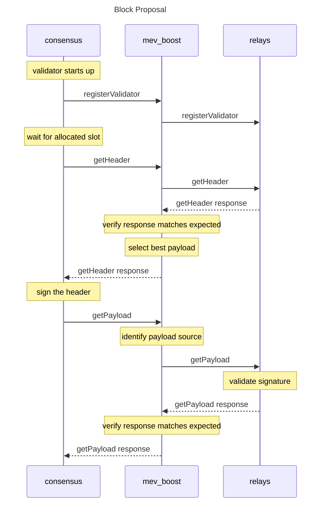

# mev-boost

[](https://goreportcard.com/report/github.com/flashbots/mev-boost)
[](https://github.com/flashbots/mev-boost/actions?query=workflow%3A%22Go%22)
[](https://discord.gg/7hvTycdNcK)
[](CODE_OF_CONDUCT.md)

A service that allows Ethereum Consensus Layer (CL) clients to outsource block construction to third party block builders in addition to execution clients.

See also:

* **[Builder API specification](https://ethereum.github.io/builder-specs/)** ([Github](https://github.com/ethereum/builder-specs))
* [mev-boost Docker image](https://hub.docker.com/r/flashbots/mev-boost/tags)
* [Integration docs (mev-boost wiki)](https://github.com/flashbots/mev-boost/wiki)

Further references:

* https://github.com/flashbots/mev-boost/wiki/The-Plan-(tm)
* https://ethresear.ch/t/mev-boost-merge-ready-flashbots-architecture/11177/
* https://hackmd.io/@paulhauner/H1XifIQ_t

---

### System diagram


([source](https://excalidraw.com/#json=VHl16agggXE1wIcnRD2RP,1irpGwhVpEgt6k05u-MbaQ))

### Request sequence



# Developing


Install required utilities:

```bash
go install github.com/ferranbt/fastssz/sszgen@latest
go install github.com/mgechev/revive@latest
go install honnef.co/go/tools/cmd/staticcheck@master
```
## Build & Run

```bash
make build
./mev-boost -relays http://0x821961b64d99b997c934c22b4fd6109790acf00f7969322c4e9dbf1ca278c333148284c01c5ef551a1536ddd14b178b9@localhost:28545
```

Alternatively, run mev-boost without compile step:

```bash
go run cmd/mev-boost/main.go -relays http://0x821961b64d99b997c934c22b4fd6109790acf00f7969322c4e9dbf1ca278c333148284c01c5ef551a1536ddd14b178b9@localhost:28545
```

If the test or target application crashes with an "illegal instruction" exception, run/rebuild with CGO_CFLAGS environment variable set to `-O -D__BLST_PORTABLE__`. This error also happens if you are on an ARM-based system, including the Apple M1/M2 chip.


```bash
export CGO_CFLAGS_ALLOW="-O -D__BLST_PORTABLE__"
export CGO_CFLAGS="-O -D__BLST_PORTABLE__" 
```

## Lint & Test

```
make test
make lint
make run-mergemock-integration
```

## Testing with mergemock

Mergemock is fully integrated: https://github.com/protolambda/mergemock

Make sure you've setup and built mergemock first, refer to its [README](https://github.com/flashbots/mergemock#quick-start) but here's a quick setup guide:

```
git clone https://github.com/protolambda/mergemock.git
cd mergemock
go build . mergemock
wget https://gist.githubusercontent.com/lightclient/799c727e826483a2804fc5013d0d3e3d/raw/2e8824fa8d9d9b040f351b86b75c66868fb9b115/genesis.json
openssl rand -hex 32 | tr -d "\n" > jwt.hex
```

Then you can run an integration test with mergemock, spawning both a mergemock relay+execution engine and a mergemock consensus client pointing to mev-boost, which in turn points to the mergemock relay:

```
cd mev-boost
make run-mergemock-integration
```

The path to the mergemock repo is assumed to be `../mergemock`, you can override like so:

```
make MERGEMOCK_DIR=/PATH-TO-MERGEMOCK-REPO run-mergemock-integration
```

to run mergemock in dev mode:

```
make MERGEMOCK_BIN='go run .' run-mergemock-integration
```

## Testing with test-cli

[test-cli readme](cmd/test-cli/README.md)
