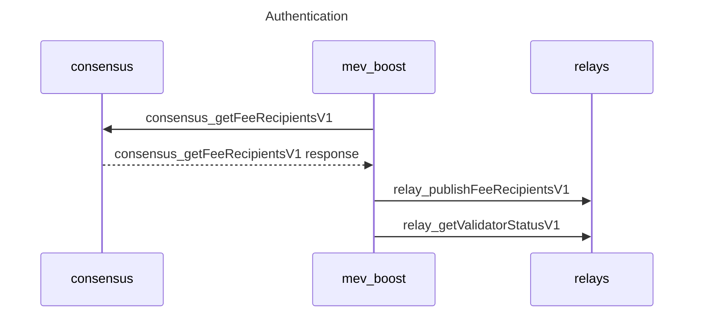
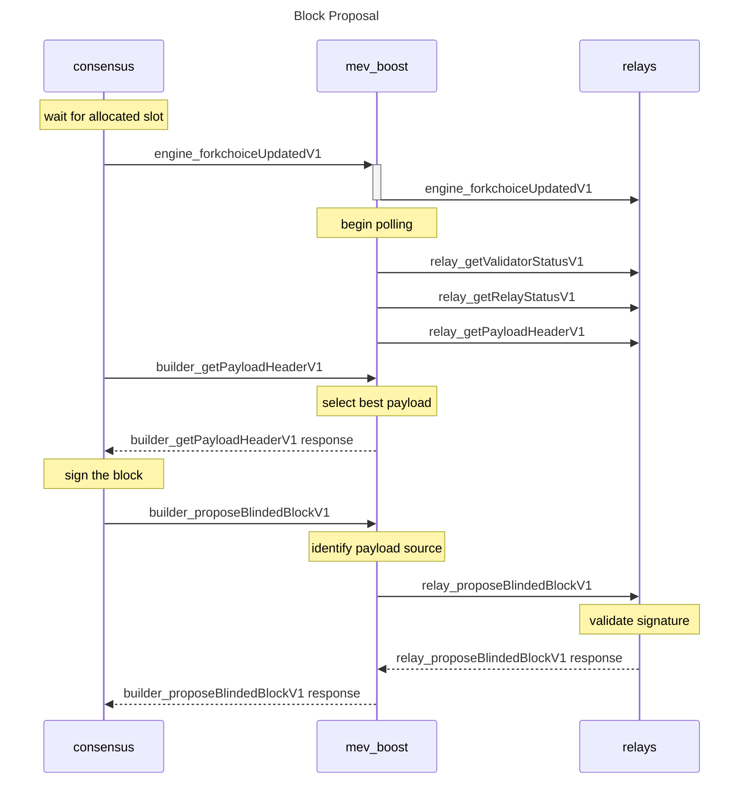
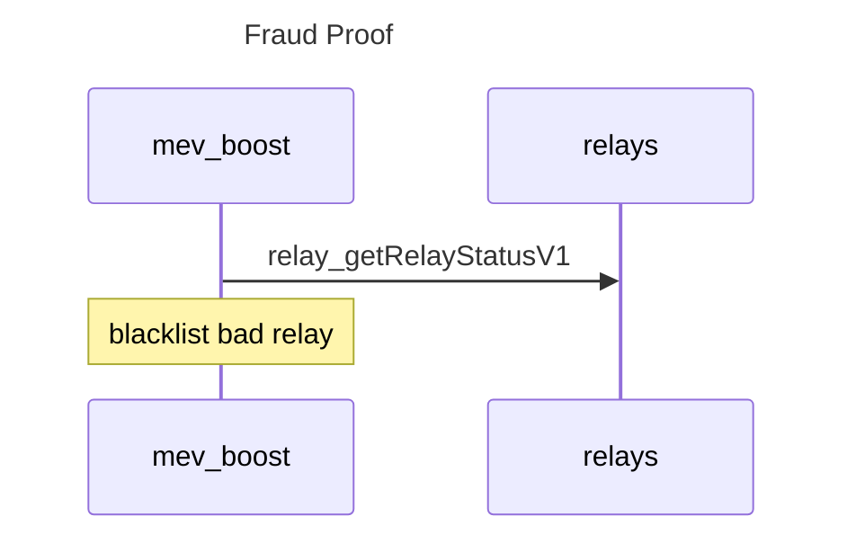

# Milestone 2 - security, authentication, & reputation

This second milestone adds all the security features necessary for production use of the software including relay and validator authentication, merkle proof of payment, and payload validity fraud proof.

## Specification

### Authentication



1. on startup, mev-boost requests a list of [`AuthenticatedFeeRecipient`](#authenticatedfeerecipient) from the consensus client using a new [`consensus_getFeeRecipientsV1`](#consensus_getfeerecipientsv1) method.
2. the list of [`AuthenticatedFeeRecipient`](#authenticatedfeerecipient) is forwarded to all connected relays using the [`relay_publishFeeRecipientsV1`](#relay_publishfeerecipientsv1) method.
3. mev-boost calls the [`relay_getValidatorStatusV1`](#relay_getvalidatorstatusv1) method on the relays to validate that the fee recipient is correctly registered.

### Block Proposal



1. mev-boost must be initialized with a list of (`BLSPublicKey`, `RelayURI`) pairs representing trusted relays.
2. mev-boost must intercept [`engine_forkchoiceUpdatedV1`](#engine_forkchoiceupdatedv1) call from the BN -> EC and begin the following polling cycle:
    1. mev-boost verifies that the relay has the correct [`FeeRecipient`](#feerecipient) for this slot tenant by calling [`relay_getValidatorStatusV1`](#relay_getvalidatorstatusv1) on the relay, if the incorrect fee recipient is returned, mev-boost enters the [`Authentication`](#authentication) process.
    2. mev-boost checks for a fraud proof by calling [`relay_getRelayStatusV1`](#relay_getrelaystatusv1) on all connected relays. If a fraud proof is returned, mev-boost preforms the [`Validation`](#validation) process.
    3. mev-boost begins polling connected relays for their [`SignedMEVPayloadHeader`](#signedmevpayloadheader) using [`relay_getPayloadHeaderV1`](#relay_getpayloadheaderv1) requests.
    4. mev-boost must verify the signature and the merkle proof of the [`SignedMEVPayloadHeader`](#signedmevpayloadheader) received to ensure the signature matches the BLS key associated with the IP of the relay, has a matching `payloadId`, and has a valid fee recipient payment.
5. upon receiving a [`builder_getPayloadHeaderV1`](#builder_getpayloadheaderv1) request from the BN, mev-boost must return the [`ExecutionPayloadHeaderV1`](https://github.com/ethereum/consensus-specs/blob/v1.1.6/specs/merge/beacon-chain.md#executionpayloadheader) with the highest associated `feeRecipientDiff` and terminate the polling cycle.
6. the BN must use the [`ExecutionPayloadHeaderV1`](https://github.com/ethereum/consensus-specs/blob/v1.1.6/specs/merge/beacon-chain.md#executionpayloadheader) received to assemble and sign a [`SignedBlindedBeaconBlock`](#signedblindedbeaconblock) and return it to mev-boost using [`builder_proposeBlindedBlockV1`](#builder_proposeblindedblockv1).
7. mev-boost must forward the [`SignedBlindedBeaconBlock`](#signedblindedbeaconblock) to all connected relays and attach the matching [`SignedMEVPayloadHeader`](#signedmevpayloadheader) using [`relay_proposeBlindedBlockV1`](#relay_proposeblindedblockv1) to inform the network of which relay created this payload.
8. if an [`ExecutionPayloadV1`](https://github.com/ethereum/consensus-specs/blob/v1.1.6/specs/merge/beacon-chain.md#executionpayload) is returned, mev-boost must verify that the root of the transaction list matches the expected transaction root from the [`SignedBlindedBeaconBlock`](#signedblindedbeaconblock) before returning it to the BN.

### Validation



1. if a relay identifies a payload which violates consensus rules and was subsequently proposed to the network, they must craft a [`FraudProof`](#fraudproof) which contains the necessary information to verify the missbehavior.
2. mev-boost requests recent fraud proofs by calling [`relay_getRelayStatusV1`](#relay_getrelaystatusv1) on connected relays.
3. If a fraud proof is returned, mev-boost extracts the identity of the offending relay from the payload signature and verifies that the signature matches the payload header.
4. mev-boost calls [`engine_executePayloadV1`](#engine_executepayloadv1) against the local execution client using the payload data provided in the fraud proof. If the response is `"INVALID"`, mev-boost immediately blacklists the relay that generated this payload.
5. the operator must manually remove the offending relay from the blacklist in order to resume receiving payloads.

### required client modifications

- consensus client must implement [blind transaction signing](https://hackmd.io/@paulhauner/H1XifIQ_t#Change-1-Blind-Transaction-Signing)
- consensus client must implement [proposal promises](https://hackmd.io/@paulhauner/H1XifIQ_t#Change-2-Proposal-Promises)
- in event of mev-boost crash, consensus client must be able to bypass the middleware to reach a local or remote execution client

## API Docs

Methods are prefixed using the following convention:
- `consensus` prefix indicates calls made to the consensus client.
- `engine` prefix indicates calls made to the execution client. These methods are specified in the [execution engine APIs](https://github.com/ethereum/execution-apis/blob/v1.0.0-alpha.5/src/engine/specification.md).
- `builder` prefix indicates calls made to the mev-boost middleware.
- `relay` prefix indicates calls made to a relay.

### consensus_getFeeRecipientsV1

#### Request

- method: `consensus_getFeeRecipientsV1`

#### Response

- result: Array of [`AuthenticatedFeeRecipient`](#authenticatedfeerecipient)
- error: code and message set in case an exception happens during request.

### engine_getPayloadV1

See [engine_getPayloadV1](https://github.com/ethereum/execution-apis/blob/v1.0.0-alpha.5/src/engine/specification.md#engine_getpayloadv1).

### engine_executePayloadV1

See [engine_executePayloadV1](https://github.com/ethereum/execution-apis/blob/v1.0.0-alpha.5/src/engine/specification.md#engine_executepayloadv1).

### builder_getPayloadHeaderV1

#### Request

- method: `builder_getPayloadHeaderV1`
- params:
  1. `payloadId`: `DATA`, 8 Bytes - Identifier of the payload build process

#### Response

- result: [`ExecutionPayloadHeaderV1`](https://github.com/ethereum/consensus-specs/blob/v1.1.6/specs/merge/beacon-chain.md#executionpayloadheader)
- error: code and message set in case an exception happens while getting the payload.

### builder_proposeBlindedBlockV1

#### Request

- method: `builder_proposeBlindedBlockV1`
- params:
  1. [`SignedBlindedBeaconBlock`](#signedblindedbeaconblock)

#### Response

- result: [`ExecutionPayloadV1`](https://github.com/ethereum/consensus-specs/blob/v1.1.6/specs/merge/beacon-chain.md#executionpayload)
- error: code and message set in case an exception happens while proposing the payload.

Technically, this call only needs to return the `transactions` field of [`ExecutionPayloadV1`](https://github.com/ethereum/consensus-specs/blob/v1.1.6/specs/merge/beacon-chain.md#executionpayload), but we return the full payload for simplicity.

### relay_publishFeeRecipientsV1

#### Request

- method: `relay_publishFeeRecipientsV1`
- params:
  1. Array of [`AuthenticatedFeeRecipient`](#authenticatedfeerecipient)

#### Response

- error: code and message set in case an exception happens while performing the request.

### relay_getValidatorStatusV1

#### Request

- method: `relay_getValidatorStatusV1`
- params:
  1. `validator`: `BLSPublicKey` - public key of the validator

#### Response

- result: [`ValidatorStatus`](#validatorstatus)
- error: code and message set in case an exception happens while performing the request.

### relay_getRelayStatusV1

#### Request

- method: `relay_getRelayStatusV1`

#### Response

- result: [`RelayStatus`](#relaystatus)
- error: code and message set in case an exception happens while performing the request.

### relay_getPayloadHeaderV1

#### Request

- method: `relay_getPayloadHeaderV1`
- params:
  1. `payloadId`: `DATA`, 8 Bytes - Identifier of the payload build process

#### Response

- result: [`SignedMEVPayloadHeader`](#signedmevpayloadheader)
- error: code and message set in case an exception happens while getting the payload.

### relay_proposeBlindedBlockV1

#### Request

- method: `relay_proposeBlindedBlockV1`
- params:
  1. [`SignedBlindedBeaconBlock`](#signedblindedbeaconblock)
  2. [`SignedMEVPayloadHeader`](#signedmevpayloadheader)

#### Response

- result: [`ExecutionPayloadV1`](https://github.com/ethereum/consensus-specs/blob/v1.1.6/specs/merge/beacon-chain.md#executionpayload)
- error: code and message set in case an exception happens while proposing the payload.

Technically, this call only needs to return the `transactions` field of [`ExecutionPayloadV1`](https://github.com/ethereum/consensus-specs/blob/v1.1.6/specs/merge/beacon-chain.md#executionpayload), but we return the full payload for simplicity.

### Types

#### AuthenticatedFeeRecipient

See [here](https://github.com/ethereum/consensus-specs/blob/v1.1.6/specs/phase0/beacon-chain.md#custom-types) for the definition of fields like `BLSSignature`

- `message`: [`FeeRecipient`](#feerecipient)
- `signature`: `BLSSignature`

#### FeeRecipient

- `feeRecipient`: `Data`, 20 Bytes - the fee recipient address requested by the validator

#### ValidatorStatus

- `feeRecipient`: `Data`, 20 Bytes - the fee recipient address requested by the validator
- `nextProposal`: `Quantity|null`, 64 Bits - value for the timestamp field of the next proposal slot held by this validator, null if there are no upcoming slots

#### RelayStatus

- `currentState`: [`ForkchoiceStateV1`](https://github.com/ethereum/execution-apis/blob/v1.0.0-alpha.5/src/engine/specification.md#forkchoicestatev1) - current state of the chain seen by the relay.
- `nextPayload`: [`PayloadAttributesV1`](https://github.com/ethereum/execution-apis/blob/v1.0.0-alpha.5/src/engine/specification.md#payloadattributesv1) - attributes of the upcoming payload.
- `fraudProofs`: Array of [`FraudProof`](#fraudproof) - any fraud proof produced in the last 64 blocks.

#### FraudProof

- `payloadHeader`: [`SignedMEVPayloadHeader`](#signedmevpayloadheader) - the invalid payload header signed by the offending relay.
- `payload`: [`ExecutionPayloadV1`](https://github.com/ethereum/consensus-specs/blob/v1.1.6/specs/merge/beacon-chain.md#executionpayload) - the invalid payload revealed to the network.
- `block`: [`SignedBlindedBeaconBlock`](#signedblindedbeaconblock) - the invalid beacon block signed and proposed by the validator.

#### SignedMEVPayloadHeader

See [here](https://github.com/ethereum/consensus-specs/blob/v1.1.6/specs/phase0/beacon-chain.md#custom-types) for the definition of fields like `BLSSignature`

- `message`: [`MEVPayloadHeader`](#mevpayloadheader)
- `signature`: `BLSSignature`

#### MEVPayloadHeader

- `payloadHeader`: [`ExecutionPayloadHeaderV1`](https://github.com/ethereum/consensus-specs/blob/v1.1.6/specs/merge/beacon-chain.md#executionpayloadheader)
- `feeRecipientProof`: [`AccountProof`](#accountproof)

Note: the feeRecipient must match the address provided in the [`AuthenticatedFeeRecipient`](#authenticatedfeerecipient) of the associated [`relay_publishFeeRecipientsV1`](#relay_publishfeerecipientsv1) request.

#### AccountProof

Refer to [EIP-1186](https://eips.ethereum.org/EIPS/eip-1186).

- `balance`: `QUANTITY` - the balance of the account.
- `nonce`: `QUANTITY`, - nonce of the account.
- `storageHash`: `DATA`, 32 Bytes - SHA3 of the StorageRoot.
- `codeHash`: `DATA`, 32 Bytes - hash of the code of the account. For a simple Account without code it will return "0xc5d2460186f7233c927e7db2dcc703c0e500b653ca82273b7bfad8045d85a470"
- `accountProof`: `ARRAY` - Array of rlp-serialized MerkleTree-Nodes, starting with the stateRoot-Node, following the path of the SHA3 (address) as key.

#### SignedBlindedBeaconBlock

See [here](https://github.com/ethereum/consensus-specs/blob/v1.1.6/specs/phase0/beacon-chain.md#custom-types) for the definition of fields like `BLSSignature`

- `message`: [`BlindedBeaconBlock`](#blindedbeaconblock)
- `signature`: `BLSSignature`

#### BlindedBeaconBlock

This is forked from [here](https://github.com/ethereum/consensus-specs/blob/v1.1.6/specs/phase0/beacon-chain.md#beaconblock) with `body` replaced with `BlindedBeaconBlockBody`

```py
class BlindedBeaconBlock(Container):
    slot: Slot
    proposer_index: ValidatorIndex
    parent_root: Root
    state_root: Root
    body: BlindedBeaconBlockBody
```

#### BlindedBeaconBlockBody

This is forked from [here](https://github.com/ethereum/consensus-specs/blob/v1.1.6/specs/merge/beacon-chain.md#beaconblockbody) with `execution_payload` replaced with [execution_payload_header](https://github.com/ethereum/consensus-specs/blob/v1.1.6/specs/merge/beacon-chain.md#executionpayloadheader)

```py
class BlindedBeaconBlockBody(Container):
    randao_reveal: BLSSignature
    eth1_data: Eth1Data
    graffiti: Bytes32
    proposer_slashings: List[ProposerSlashing, MAX_PROPOSER_SLASHINGS]
    attester_slashings: List[AttesterSlashing, MAX_ATTESTER_SLASHINGS]
    attestations: List[Attestation, MAX_ATTESTATIONS]
    deposits: List[Deposit, MAX_DEPOSITS]
    voluntary_exits: List[SignedVoluntaryExit, MAX_VOLUNTARY_EXITS]
    sync_aggregate: SyncAggregate
    execution_payload_header: ExecutionPayloadHeader
```

