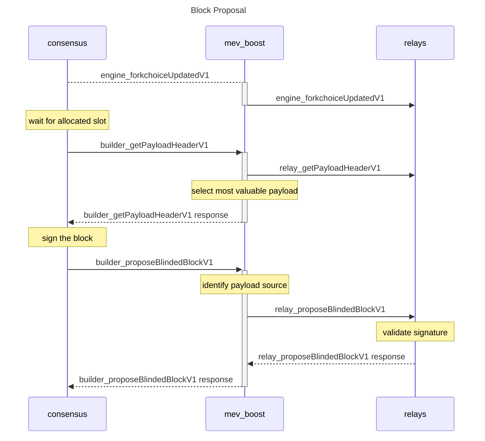

# Version 0.1 (current, milestone 1, running on [Kiln testnet](https://kiln.themerge.dev/))

This initial milestone provides simple sidecar logic with minimal consensus client changes, simple networking, no validator authentication, and manual safety mechanism.

1. _mev-boost_ is initialized with a list of `RelayURI`s from trusted relays.

2. _mev-boost_ receives a [`engine_forkchoiceUpdatedV1`](#engine_forkchoiceupdatedv1) call from a beacon node and forwards it to all connected relays to communicate `feeRecipient`.

3. _mev_boost_ receives [`builder_getPayloadHeaderV1`](#builder_getpayloadheaderv1) request from the beacon node, and forwards it to all relays as `relay_getPayloadHeaderV1`. _mev-boost_ must return the [`ExecutionPayloadHeaderV1`](https://github.com/ethereum/consensus-specs/blob/v1.1.6/specs/merge/beacon-chain.md#executionpayloadheader) with the highest associated `feeRecipientDiff`.

4. The _beacon node_ must use the [`ExecutionPayloadHeaderV1`](https://github.com/ethereum/consensus-specs/blob/v1.1.6/specs/merge/beacon-chain.md#executionpayloadheader) received to assemble and sign a [`SignedBlindedBeaconBlock`](#signedblindedbeaconblock) and return it to _mev-boost_ using [`builder_proposeBlindedBlockV1`](#builder_proposeblindedblockv1).

5. _mev-boost_ must forward the [`SignedBlindedBeaconBlock`](#signedblindedbeaconblock) to all connected relays and attach the matching [`SignedMEVPayloadHeader`](#signedmevpayloadheader) using [`relay_proposeBlindedBlockV1`](#relay_proposeblindedblockv1) to inform the network of which relay created this payload.

6. If an [`ExecutionPayloadV1`](https://github.com/ethereum/consensus-specs/blob/v1.1.6/specs/merge/beacon-chain.md#executionpayload) is returned, _mev-boost_ must verify that the root of the transaction list matches the expected transaction root from the [`SignedBlindedBeaconBlock`](#signedblindedbeaconblock) before returning it to the _beacon node_.

## Required client modifications

- consensus client must implement [blind transaction signing](https://hackmd.io/@paulhauner/H1XifIQ_t#Change-1-Blind-Transaction-Signing)

## API

Methods are prefixed using the following convention:

- `engine` prefix indicates calls made to the execution client. These methods are specified in the [execution engine APIs](https://github.com/ethereum/execution-apis/blob/v1.0.0-alpha.8/src/engine/specification.md).
- `builder` prefix indicates calls made to the mev-boost sidecar.
- `relay` prefix indicates calls made to a relay.

### engine_forkchoiceUpdatedV1

See [engine_forkchoiceUpdatedV1](https://github.com/ethereum/execution-apis/blob/v1.0.0-alpha.8/src/engine/specification.md#engine_forkchoiceupdatedv1).

### builder_proposeBlindedBlockV1

#### Request

- method: `builder_proposeBlindedBlockV1`
- params:
  1. [`SignedBlindedBeaconBlock`](#signedblindedbeaconblock)

#### Response

- result: [`ExecutionPayloadV1`](https://github.com/ethereum/consensus-specs/blob/v1.1.10/specs/bellatrix/beacon-chain.md#executionpayload).
- error: code and message set in case an exception happens while proposing the payload.

Technically, this call only needs to return the `transactions` field of [`ExecutionPayloadV1`](https://github.com/ethereum/consensus-specs/blob/v1.1.10/specs/bellatrix/beacon-chain.md#executionpayload), but we return the full payload for simplicity.

### builder_getPayloadHeaderV1

#### Request

- method: `builder_getPayloadHeaderV1`
- params:
  1. `payloadId`: `DATA`, 8 Bytes - Identifier of the payload build process

#### Response

- result: [`ExecutionPayloadHeaderV1`](https://github.com/ethereum/consensus-specs/blob/v1.1.10/specs/bellatrix/beacon-chain.md#executionpayloadheader)
- error: code and message set in case an exception happens while getting the payload.

### relay_getPayloadHeaderV1

#### Request

- method: `relay_getPayloadHeaderV1`
- params:
  1. `payloadId`: `DATA`, 8 Bytes - Identifier of the payload build process

#### Response

- result: [`SignedMEVPayloadHeader`](#signedmevpayloadheader)
- error: code and message set in case an exception happens while getting the payload.

### relay_proposeBlindedBlockV1

#### Request

- method: `relay_proposeBlindedBlockV1`
- params:
  1. [`SignedBlindedBeaconBlock`](#signedblindedbeaconblock)
  2. [`SignedMEVPayloadHeader`](#signedmevpayloadheader)

#### Response

- result: [`ExecutionPayloadV1`](https://github.com/ethereum/consensus-specs/blob/v1.1.10/specs/bellatrix/beacon-chain.md#executionpayload)
- error: code and message set in case an exception happens while proposing the payload.

Technically, this call only needs to return the `transactions` field of [`ExecutionPayloadV1`](https://github.com/ethereum/consensus-specs/blob/v1.1.10/specs/bellatrix/beacon-chain.md#executionpayload), but we return the full payload for simplicity.

### Types

#### SignedMEVPayloadHeader

See [here](https://github.com/ethereum/consensus-specs/blob/v1.1.10/specs/phase0/beacon-chain.md#custom-types) for the definition of fields like `BLSSignature`

- message: [MEVPayloadHeader](#mevpayloadheader)
- signature: BLSSignature

#### MEVPayloadHeader

- payloadHeader: [`ExecutionPayloadHeaderV1`](https://github.com/ethereum/consensus-specs/blob/v1.1.10/specs/bellatrix/beacon-chain.md#executionpayloadheader)
- feeRecipientDiff: Quantity, 256 Bits - the change in balance of the feeRecipient address

#### SignedBlindedBeaconBlock

See [here](https://github.com/ethereum/consensus-specs/blob/v1.1.10/specs/phase0/beacon-chain.md#custom-types) for the definition of fields like `BLSSignature`

- message: [BlindedBeaconBlock](#blindedbeaconblock)
- signature: BLSSignature

#### BlindedBeaconBlock

This is forked from [here](https://github.com/ethereum/consensus-specs/blob/v1.1.10/specs/phase0/beacon-chain.md#beaconblock) with `body` replaced with `BlindedBeaconBlockBody`

- slot: Slot
- proposer_index: ValidatorIndex
- parent_root: Root
- state_root: Root
- body: BlindedBeaconBlockBody

#### BlindedBeaconBlockBody

This is forked from [here](https://github.com/ethereum/consensus-specs/blob/v1.1.10/specs/merge/beacon-chain.md#beaconblockbody) with `execution_payload` replaced with [execution_payload_header](https://github.com/ethereum/consensus-specs/blob/v1.1.10/specs/bellatrix/beacon-chain.md#executionpayloadheader)

- randao_reveal: BLSSignature
- eth1_data: Eth1Data
- graffiti: Bytes32
- proposer_slashings: List[ProposerSlashing, MAX_PROPOSER_SLASHINGS]
- attester_slashings: List[AttesterSlashing, MAX_ATTESTER_SLASHINGS]
- attestations: List[Attestation, MAX_ATTESTATIONS]
- deposits: List[Deposit, MAX_DEPOSITS]
- voluntary_exits: List[SignedVoluntaryExit, MAX_VOLUNTARY_EXITS]
- sync_aggregate: SyncAggregate
- execution_payload_header: ExecutionPayloadHeader
