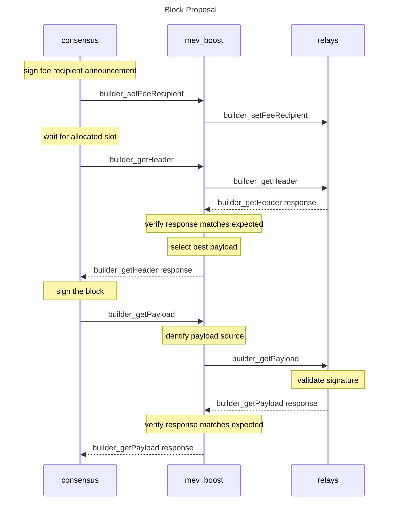

# Version 0.2

This document specifies the Builder API methods that the Consensus Layer uses to interact with external block builders.



## Structures

### `ExecutionPayloadV1`

Mirror of [`ExecutionPayloadV1`][execution-payload].

### `ExecutionPayloadHeaderV1`

Equivalent to `ExecutionPayloadV1`, except `transactions` is replaced with `transactionsRoot`.
- `parentHash`: `DATA`, 32 Bytes
- `feeRecipient`:  `DATA`, 20 Bytes
- `stateRoot`: `DATA`, 32 Bytes
- `receiptsRoot`: `DATA`, 32 Bytes
- `logsBloom`: `DATA`, 256 Bytes
- `prevRandao`: `DATA`, 32 Bytes
- `blockNumber`: `QUANTITY`, 64 Bits
- `gasLimit`: `QUANTITY`, 64 Bits
- `gasUsed`: `QUANTITY`, 64 Bits
- `timestamp`: `QUANTITY`, 64 Bits
- `extraData`: `DATA`, 0 to 32 Bytes
- `baseFeePerGas`: `QUANTITY`, 256 Bits
- `blockHash`: `DATA`, 32 Bytes
- `transactionsRoot`: `DATA`, 32 Bytes

#### SSZ Objects

Consider the following definitions supplementary to the definitions in [`consensus-specs`][consensus-specs].

##### `builder_setFeeRecipientV1` Request

```python
class Request(Container):
    feeRecipient: Bytes20
    timestamp: uint64
```

##### `builder_getPayloadV1` Response

```python
class Response(Container):
    payload: ExecutionPayloadHeader
    value: uint256
```

##### `builder_getPayloadV1` Request

###### `BlindBeaconBlock`

```python
class BlindBeaconBlock(Container):
    slot: Slot
    proposer_index: ValidatorIndex
    parent_root: Root
    state_root: Root
    body: BlindBeaconBlockBody
```

###### `BlindBeaconBlockBody`

```python
class BlindBeaconBlockBody(Container):
    randao_reveal: BLSSignature
    eth1_data: Eth1Data
    graffiti: Bytes32
    proposer_slashings: List[ProposerSlashing, MAX_PROPOSER_SLASHINGS]
    attester_slashings: List[AttesterSlashing, MAX_ATTESTER_SLASHINGS]
    attestations: List[Attestation, MAX_ATTESTATIONS]
    deposits: List[Deposit, MAX_DEPOSITS]
    voluntary_exits: List[SignedVoluntaryExit, MAX_VOLUNTARY_EXITS]
    sync_aggregate: SyncAggregate
    execution_payload: ExecutionPayloadHeader
```

## Errors

The list of error codes introduced by this specification can be found below.

| Code | Message | Meaning |
| - | - | - |
| -32000 | Server error | Generic client error while processing request. |
| -32001 | Unknown hash | No block with the provided hash is known. |
| -32002 | Unknown validator | No known mapping between validator and feeRecipient. |
| -32003 | Invalid SSZ | Unable to decode SSZ. |
| -32004 | Unknown block | Block does not match the provided header. |
| -32005 | Invalid signature | Provided signature is invalid. |
| -32006 | Invalid timestamp | Provided timestamp was invalid. |
| -32600 | Invalid request | The JSON sent is not a valid Request object. |
| -32601 | Method not found | The method does not exist / is not available. |
| -32602 | Invalid params | Invalid method parameter(s). |
| -32603 | Internal error | Internal JSON-RPC error. |
| -32700 | Parse error | Invalid JSON was received by the server. |

## Routines

### Signing

All signature operations should follow the [standard BLS operations][bls] interface defined in `consensus-specs`.

There are two types of data to sign over in the Builder API:
* In-protocol messages, e.g. [`BlindBeaconBlock`](#blindbeaconblock), which should compute the signing root using [`computer_signing_root`][compute-signing-root] and use the domain specified for beacon block proposals.
* Builder API messages, e.g. [`builder_setFeeRecipientV1`](#builder_setFeeRecipientV1), which should compute the signing root using [`compute_signing_root`][compute-signing-root] and the domain `DomainType('0xXXXXXXXX')` (TODO: get a proper domain).

As `compute_signing_root` takes `SSZObject` as input, client software should convert in-protocol messages to their SSZ representation to compute the signing root and Builder API messages to the SSZ representations defined [above](#sszobjects).

## Methods

### `builder_setFeeRecipientV1`

#### Request

- method: `builder_setFeeRecipientV1`
- params:
  1. `feeRecipient`: `DATA`, 20 Bytes - Address of account which should receive fees.
  2. `timestamp`: `QUANTITY`, uint64 - Unix timestamp of announcement.
  2. `publicKey`: `DATA`, 48 Bytes - Public key of validator.
  3. `signature`: `DATA`, 96 Bytes - Signature over `feeRecipient`.

#### Response

- result: `null`
- error: code and message set in case an exception happens while getting the payload.

#### Specification
1. Builder software **MUST** verify `signature` is valid under `publicKey`.
2. Builder software **MUST** respond to requests where `timestamp` is before the latest announcement from the validator or more than +/- 10 seconds from the current time with `-32006: Invalid timestamp`.
3. Builder software **MUST** store `feeRecipient` in a map keyed by `publicKey`.

### `builder_getHeaderV1`

#### Request

- method: `builder_getHeaderV1`
- params:
  1. `hash`: `DATA`, 32 Bytes - Hash of block which the validator intends to use as the parent for its proposal.

#### Response

- result: `object`
    - `payload`: [`ExecutionPayloadHeaderV1`](#executionpayloadheaderv1).
    - `value`: `DATA`, 32 Bytes - the change in wei balance of the `feeRecipient` account.
    - `publicKey`: `DATA`, 48 Bytes - the public key associated with the builder.
    - `signature`: `DATA`, 96 Bytes - BLS signature of the builder over `payload` and `value`.
- error: code and message set in case an exception happens while getting the payload.

#### Specification
1. Builder software **SHOULD** respond immediately with the `payload` that increases the `feeRecipient`'s balance by the most.
2. Builder software **MUST** return `-32001: Unknown hash` if the block identified by `hash` does not exist.
3. Builder software **MUST** return `-32002: Unknown validator` if the recovered validator public key has not been mapped to a `feeRecipient`.

### `builder_getPayloadV1`

#### Request

- method: `builder_getPayloadV1`
- params:
  1. `block`: `DATA`, arbitray length - SSZ encoded [`BlindBeaconBlock`](#blindbeaconblock).
  2. `signature`: `DATA`, 96 Bytes - BLS signature of the validator over `block`.

#### Response

- result: [`ExecutionPayloadV1`][#executionpayloadv1].
- error: code and message set in case an exception happens while proposing the payload.

#### Specification
1. Builder software **MUST** verify that `block` is an SSZ encoded [`BlindBeaconBlock`](#blindbeaconblock). If the block is encoded incorrectly, the builder **MUST** return `-32003: Invalid SSZ`. If the block is encoded correctly, but does not match the `ExecutionPayloadHeaderV1` provided in `builder_getExecutionPayloadHeaderV1`, the builder **SHOULD** return `-32004: Unknown block`. If the CL modifies the payload in such a way that it is still valid and the builder is able to unblind it, the builder **MAY** update the payload on it's end to reflect the CL's changes before returning it.
2. Builder software **MUST** verify that `signature` is a BLS signature over `block`, verifiable using [`verify_block_signature`][verify-block-signature] and the validator public key that is expected to propose in the given slot. If the signature is determined to be invalid or from a different validator than expected, the builder **MUST** return `-32005: Invalid signature`.

[consensus-specs]: https://github.com/ethereum/consensus-specs
[bls]: https://github.com/ethereum/consensus-specs/blob/dev/specs/phase0/beacon-chain.md#bls-signatures
[compute-signing-root]: https://github.com/ethereum/consensus-specs/blob/dev/specs/phase0/beacon-chain.md#compute_signing_root
[bytes20]: https://github.com/ethereum/consensus-specs/blob/dev/ssz/simple-serialize.md#aliases
[uint256]: https://github.com/ethereum/consensus-specs/blob/dev/ssz/simple-serialize.md#basic-types
[execution-payload-header]: https://github.com/ethereum/consensus-specs/blob/dev/specs/bellatrix/beacon-chain.md#executionpayloadheader
[execution-payload]: https://github.com/ethereum/execution-apis/blob/main/src/engine/specification.md#executionpayloadv1
[hash-tree-root]: https://github.com/ethereum/consensus-specs/blob/dev/ssz/simple-serialize.md#merkleization
[beacon-block]: https://github.com/ethereum/consensus-specs/blob/dev/specs/phase0/beacon-chain.md#beaconblock
[verify-block-signature]: https://github.com/ethereum/consensus-specs/blob/dev/specs/phase0/beacon-chain.md#beacon-chain-state-transition-function
