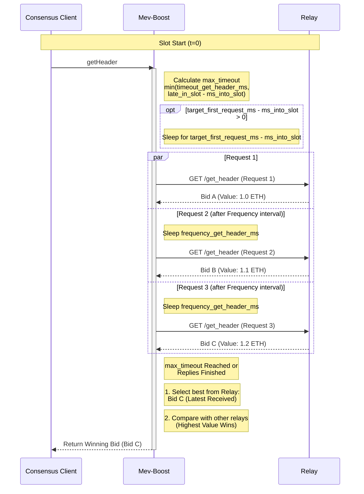

# Timing Games

The **Timing Games** feature allows `mev-boost` to optimize block proposal by strategically timing `getHeader` requests to relays. Instead of sending a single request immediately, it can delay the initial request and send multiple follow-up requests to capture the latest, most valuable bids before the proposal deadline.

## Configuration

To enable timing games, you must provide a YAML configuration file using the `-config` flag:

```bash
./mev-boost -config config.yaml
```

To enable hot reloading of the configuration file, add the `-watch-config` flag:

```bash
./mev-boost -config config.yaml -watch-config
```

## Global Timeouts

These settings apply to all relays and define the hard boundaries for the `getHeader` operation.

*   **`timeout_get_header_ms`** (optional, default: 950ms)
    * It is the maximum timeout in milliseconds for get_header requests to relays.

*   **`late_in_slot_time_ms`** (optional, default: 2000ms)
    *   It is a safety threshold in milliseconds that marks when in a slot we consider it "too late" to fetch headers from relays. If the request arrives after the threshold, it skips all relay requests and forces local block building.

## Per-Relay Configuration

These parameters are configured individually for each relay in `config.yaml`.

*   **`enable_timing_games`** (optional, default: false)
    *   Enables the timing games logic for this specific relay. If `false`, standard behavior is used (single request, immediate execution).

*   **`target_first_request_ms`** (`uint64`)
    *   It is the target time in milliseconds into the slot when the first get_header request should be sent to a relay. It's only used when `enable_timing_games = true`

*   **`frequency_get_header_ms`** (`uint64`)
    *   The interval in milliseconds between subsequent requests to the same relay. After the first request is sent, `mev-boost` will keep sending new requests every `frequency_get_header_ms` until the global timeout budget is exhausted.

## Example Configuration

See [config.example.yaml](../config.example.yaml) for a fully documented example configuration file.

## Visual Representation



## How It Works

1. **Calculate budget**: When a `getHeader` request arrives, mev-boost calculates the maximum time budget as `min(timeout_get_header_ms, late_in_slot_time_ms - ms_into_slot)`.

2. **Delay first request**: With timing games enabled, If `target_first_request_ms` is set, mev-boost waits until that target time before sending the first request.

3. **Delay multiple subsequent requests**: With timing games enabled, if `frequency_get_header_ms` is set, mev-boost sends multiple requests at intervals of `frequency_get_header_ms` until the budget is exhausted.

4. **Best Bid Selection**: From all responses received, mev-boost selects the most recently received bid from each relay, then compares across relays to return the highest value bid.
